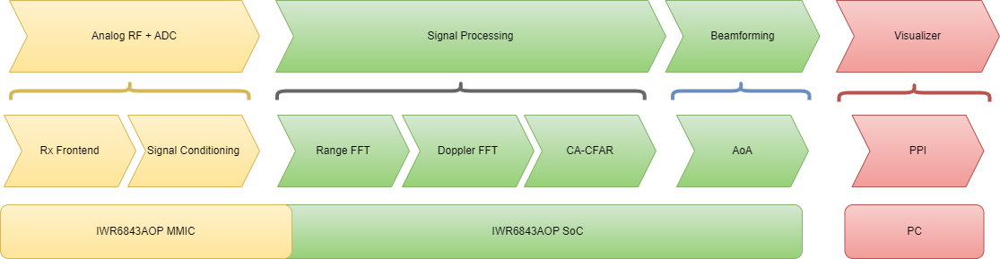

# millimeter-wave-radar-system
Welcome to the people detection radar system repo! This repo contains code and files needed to build a millimeter wave radar system capable of detecting range and doppler of a human target using the **[IWR6843A0P](https://www.ti.com/tool/IWR6843AOPEVM#description)** System on a Chip(SoC). The radar signal processing analysis was performed using MATLAB. A simulation of an FMCW radar system was developed to confirm that the selected radar parameters were appropriate for the desired application of the radar system. That simulation was then used to produce a production model capable of processing radar data captured by the **[IWR6843A0P](https://www.ti.com/tool/IWR6843AOPEVM#description)**. A moving target indicator radar signal data processing chain was implemented in MATLAB to peform analysis of the data. Finally a C application was compiled and deployed to the **[IWR6843A0P](https://www.ti.com/tool/IWR6843AOPEVM#description)** MCU and DSP to process the data in real time producing the necessary outputs that are provided as input to the radar visualizer. The overall objective of this project was the production of a range doppler map which shows how far a moving target is from the radar in meters and the velocity at which it is moving in meters per second. As a bonus angle of arrival was also estimated with limited accuracy due to a small number of antenna elements and the selected method of beamforming.

# MTI Data Processing Chain

## Project Folders
### docs
This folder contains the project specification document as diagrams. 
docs 
┣ images 
┃ ┣ FastFourierTransform.png 
┃ ┣ fmcw-range-sim-measurment.png 
┃ ┣ fmcw-sim-capture.png 
┃ ┣ Project flow chart.png 
┃ ┣ Screenshot 2024-05-18 133608-range-eq.png 
┃ ┗ Signal propagation model.png 
┣ project_specification 
┃ ┣ img 
┃ ┃ ┗ ucsd_logo.jpg 
┃ ┣ tex 
┃ ┃ ┗ doc.tex 
┃ ┣ .gitignore 
┃ ┣ Makefile 
┃ ┣ project_specification.aux 
┃ ┣ project_specification.log 
┃ ┣ project_specification.out 
┃ ┣ project_specification.pdf 
┃ ┣ project_specification.toc 
┃ ┗ texput.log 
┗ .gitkeep
### matlab
This folder contains matlab scripts that model and simulate an FMCW radar capable of detecting a human target in range and doppler. 
matlab 
 ┣ common 
 ┃ ┣ fmcw 
 ┃ ┃ ┣ calc_fmcw_angle_fft.m 
 ┃ ┃ ┣ calc_fmcw_angular_res.m 
 ┃ ┃ ┣ calc_fmcw_max_range.m 
 ┃ ┃ ┣ calc_fmcw_max_range_snr_det.m 
 ┃ ┃ ┣ calc_fmcw_max_velocity.m 
 ┃ ┃ ┣ calc_fmcw_max_velocity_res.m 
 ┃ ┃ ┣ create_fmcw_vectors.m 
 ┃ ┃ ┗ get_aoa_vector.m 
 ┃ ┣ auto_correlation.m 
 ┃ ┣ calc_dopp_params.m 
 ┃ ┣ calc_min_snr_det.m 
 ┃ ┣ calc_min_tgt_det_rng.m 
 ┃ ┣ calc_n_pulse_per_cpi.m 
 ┃ ┣ calc_n_samp_per_pulse.m 
 ┃ ┣ calc_rel_vel_and_rng.m 
 ┃ ┣ calc_tgt_snr.m 
 ┃ ┣ calc_trgt_prob_det.m 
 ┃ ┣ calc_unamb_rng.m 
 ┃ ┣ calc_unamb_vel.m 
 ┃ ┣ cfar_2d_rdm.m 
 ┃ ┣ compress_signal.m 
 ┃ ┣ create_coherent_data.m 
 ┃ ┣ create_coherent_rdm.m 
 ┃ ┣ create_coherent_rdm2.m 
 ┃ ┣ create_complex_slow_time_vec.m 
 ┃ ┣ create_fast_time_freq.m 
 ┃ ┣ create_lfm_pulse_samples.m 
 ┃ ┣ create_lfm_pulse_time.m 
 ┃ ┣ create_range_migrated_data.m 
 ┃ ┣ create_signal_data.m 
 ┃ ┣ create_vectors.m 
 ┃ ┣ cross_correlation.m 
 ┃ ┣ match_filter_signal.m 
 ┃ ┗ remove_range_migration.m 
 ┣ data 
 ┃ ┗ adc_data.bin 
 ┣ sim 
 ┃ ┣ aoa_sim.m 
 ┃ ┣ beam_pattern_sim.m 
 ┃ ┣ calc_aoa_in_meters.m 
 ┃ ┣ cfar_2d_rdm_sim.m 
 ┃ ┣ cfar_ca_sim.m 
 ┃ ┣ cfar_example.m 
 ┃ ┣ helper_plot_multiple_beam_pattern.m 
 ┃ ┣ iwr6843aop_phased_tlbx_radar_sim.m 
 ┃ ┣ iwr6843aop_radar_sim.m 
 ┃ ┣ mti.m 
 ┃ ┣ music_alg_aoa_sim.m 
 ┃ ┣ prf_example.m 
 ┃ ┣ Radar.m 
 ┃ ┣ radar_simulation.slx 
 ┃ ┣ README.m 
 ┃ ┗ Target.m 
 ┣ util 
 ┃ ┗ read_dca_1000.m 
 ┣ visualizer 
 ┃ ┣ README.md 
 ┃ ┗ visualizer.m 
 ┣ FmcwRadar.m 
 ┣ process_iwr6843aop_data.m 
 ┗ README.md 
### src
This folder contains c source codes used for building and application that execute on the IWR6843AOP SoC. 
src 
 ┣ .launches 
 ┃ ┗ out_of_box_6843_aop.launch 
 ┣ .settings 
 ┃ ┣ org.eclipse.cdt.codan.core.prefs 
 ┃ ┣ org.eclipse.cdt.debug.core.prefs 
 ┃ ┗ org.eclipse.core.resources.prefs 
 ┣ configuration_profiles 
 ┃ ┣ xwr68xx_AOP_profile_2024_05_11T23_47_56_599.cfg 
 ┃ ┗ xwr68xx_AOP_profile_static_clutter_reduced.cfg 
 ┣ src 
 ┃ ┣ sysbios 
 ┃ ┃ ┣ makefile 
 ┃ ┃ ┗ sysbios.aer4ft 
 ┃ ┣ .exclude 
 ┃ ┗ makefile.libs 
 ┣ .ccsproject 
 ┣ .cproject 
 ┣ .gitignore 
 ┣ .project 
 ┣ .xdchelp 
 ┣ antenna_geometry.c 
 ┣ data_path.c 
 ┣ main.c 
 ┣ mmw.cfg 
 ┣ mmwdemo_adcconfig.c 
 ┣ mmwdemo_flash.c 
 ┣ mmwdemo_monitor.c 
 ┣ mmwdemo_rfparser.c 
 ┣ mmw_cli.c 
 ┣ mmw_lvds_stream.c 
 ┣ objectdetection.c 
 ┗ XDS110.ccxml 
### util
This folder contains small utility programs used to assit in testing the radar system.  
arduino 
 ┣ ble_motor_conrol 
 ┃ ┗ ble_motor_conrol.ino 
 ┗ MotorControl 
 ┃ ┗ ble_motor_conrol.ino 

# People Detection Radar Presentation
The following links contain presentations demonstrating the various phases of development for the People Detection project. The 1st presentation provides an overview of the project and each sprint presentation highlights accomplishments we've made through each phase of development up to project completion
 
 
[64GHz People Detection Radar](https://docs.google.com/presentation/d/1UIobzvt940PiRzJJoqzG_jstFSM7m4pV/edit?usp=drive_link&ouid=112085791097240071479&rtpof=true&sd=true)
 
[Sprint 1](https://docs.google.com/presentation/d/17Z4IEgLOOTPaDsA3-klGJfAxYMCZCAKe/edit?usp=drive_link&ouid=112085791097240071479&rtpof=true&sd=true)
 
[Sprint 2](https://docs.google.com/presentation/d/12oHWV6L4Eyr7IAybFQ9ZD15lLnU75F-t/edit?usp=drive_link&ouid=112085791097240071479&rtpof=true&sd=true)
 
[Sprint 3](https://docs.google.com/presentation/d/18pwAkHE_p4_Qab5gMU5JxtgKBYnQPv2Z/edit?usp=drive_link&ouid=112085791097240071479&rtpof=true&sd=true)
 
[Sprint 4](https://docs.google.com/presentation/d/182JTYqSuuebc5cSZfN3FYDypfgK6dsb8/edit?usp=drive_link&ouid=112085791097240071479&rtpof=true&sd=true)
 
[Sprint 5](https://docs.google.com/presentation/d/1BEKzpFS6jXvX48bXmcZpeML1otvU0zG0/edit?usp=drive_link&ouid=112085791097240071479&rtpof=true&sd=true)
 
[Sprint 6](https://docs.google.com/presentation/d/1BQ_VSe1GsIoxJrYLUMS8agz4udzsNNxs/edit?usp=drive_link&ouid=112085791097240071479&rtpof=true&sd=true)
 
[Sprint 7](https://docs.google.com/presentation/d/1vSYEG_gKn_QH3Cs1vhudIISilF88ROOK/edit?usp=sharing&ouid=112085791097240071479&rtpof=true&sd=true)
 
 
[Final Presentation](https://drive.google.com/file/d/1-2rGQtX42mz8FN6Se58B0nz1l1jNucHP/view?usp=sharing)
 

