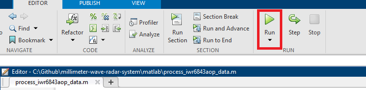
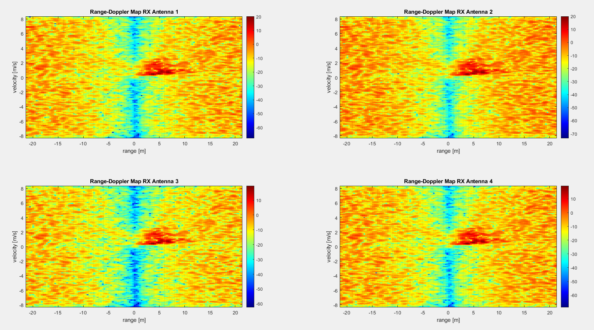
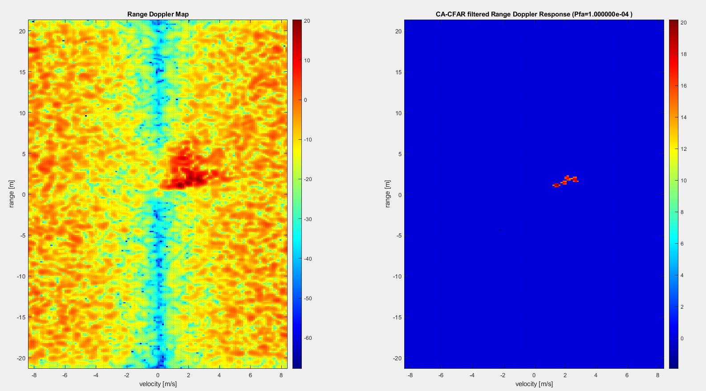

# MATLAB
The root level of this folder contains MATLAB scripts used to process radar data captured by the **[IWR6843A0P](https://www.ti.com/tool/IWR6843AOPEVM#description)**. The [process_iwr6843aop_data](process_iwr6843aop_data.m) file can be used to perform analysis of the moving target indicator radar data processing chain. The [process_iwr6843aop_data](process_iwr6843aop_data.m) prints out the selected radar parameters used for processing the specified data file, generates plots for analyzing the range doppler response, target detection using CA-CFAR algorithm, and angle of arrival estimation.

## How to run the MTI data processor
1. Define the radar parameters
    ```matlab
    rx_data = read_dca_1000(file_name="adc_data.bin");
    %% IWR68843AOP Medium Range Radar(MRR) Specifications
    %%%%%%%%%%%%%%%%%%%%%%%%%%%
    % Frequency of operation = 60GHz
    % Max Range = 22m
    % Range Resolution = 0.08 m or 8cm
    % Max Velocity = 35 mph
    % Velocity Resolutin = 40 cm
    % Max Angular FoV = 180 deg
    % Angular Resolution = 28 deg
    %%%%%%%%%%%%%%%%%%%%%%%%%%%
    % Define constants
    lightspeed = physconst('LightSpeed');

    %% Define Radar parameters
    tx_antennas = 2;
    rx_antennas  = 4;
    radar = FmcwRadar();
    radar.Pt_watts            = (db2pow(15)/1000) * tx_antennas; % actually milliwats for this radar
    radar.Gt_db               = 5; % dBi
    radar.Gr_db               = radar.Gt_db;
    radar.Freq_Center_hz      = 60e9;
    radar.Bandwidth_hz        = 1798e6;
    radar.chirp_dur_secs      = 50*1e-6;
    radar.frame_time_secs     = 12.8*1e-3;
    radar.Lambda_m            = freq2wavelen(radar.Freq_Center_hz,lightspeed); % Wavelength (m)
    radar.num_chirps          = 128;
    radar.if_max_hz           = 4.5e6; % (IF or Max beat freq)
    radar.slope_hz_us         = 30e6;
    radar.Fs_hz               = radar.if_max_hz *10; % oversample

    % Define CA-CFAR parameters
    pd = 0.9;
    pfa = 1e-5;
    number_of_samples = 10;
    ```
2. Open the [process_iwr6843aop_data](process_iwr6843aop_data.m)
3. Click Run<br/>
        


## Examples
* Radar Data Processor Parameters
    | Radar Parameters                   | Measurement  |
    |------------------------------------|--------------|
    | Radar Max Range                    | 22.48 meters |
    | Radar Max Range given Target SNR   | 111.32 m     |
    | Radar Min SNR for Target detection | 10.18 dB     |
    | Radar Center Frequency             | 60.00 GHz    |
    | Radar Sampling Rate                | 45.00 MHz    |
    | Radar Bandwidth                    | 1798.00 MHz  |
    | Radar I/F                          | 4.50 MHz     |
    | Radar Slope                        | 30.00 MHz/us |
    | Radar Chirps                       | 128.00       |
    | Radar Chirp Duration               | 50.00 us     |
    | Radar Range Resolution             | 0.08 m       |
    | Radar Velocity Resolution          | 0.3903548 m  |
    | Radar Max Velocity                 | 8.33 m       |
    | Angular Resolution                 | 57.30 deg    |
    | Max unambiguous Angular Range      | (±)90.00 deg |
    | Target Angle Estimate              | 14.59 deg    |
    | Actual Target Angle                | 26.57 deg    |

* Range Doppler Map from 4 Receive Channels

    

* Range Doppler Map from 1 Receive Channel with CA-CFAR applied

    
 
## Folders
### common
This folder includes common matlab scripts used when buiding radar simulations.
### data
This folder holds data captured using the IWR6843AOP device.
### sim
This folder includes matlab scripts that were used for simulating a human target and producing a range doppler map. 
### util
This folder includes matlab scripts that server as utilities that perform simple tasks needed by the simulator.