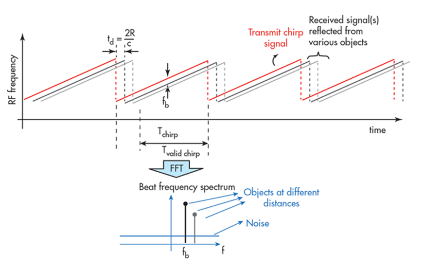
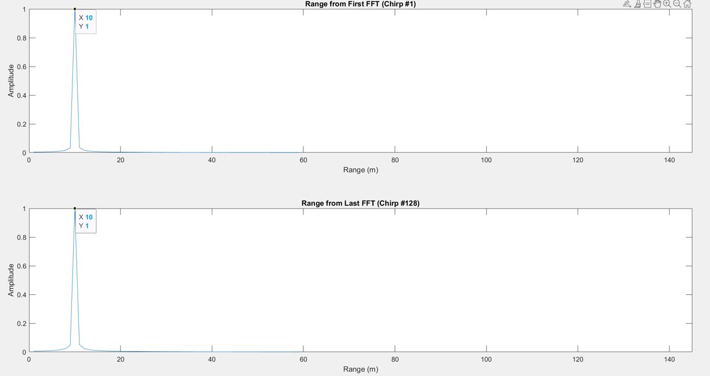
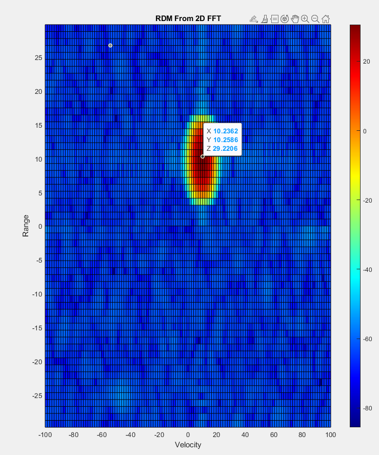
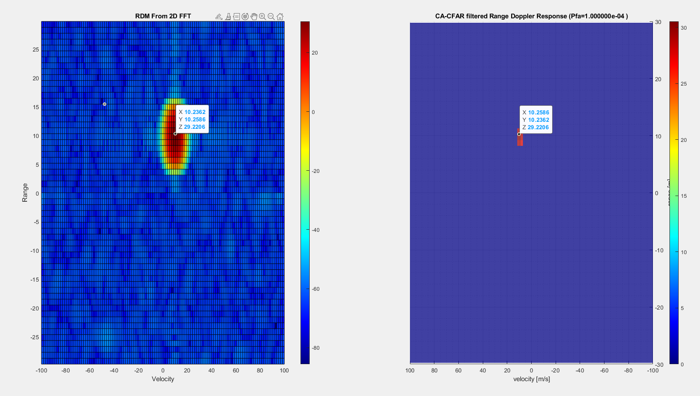
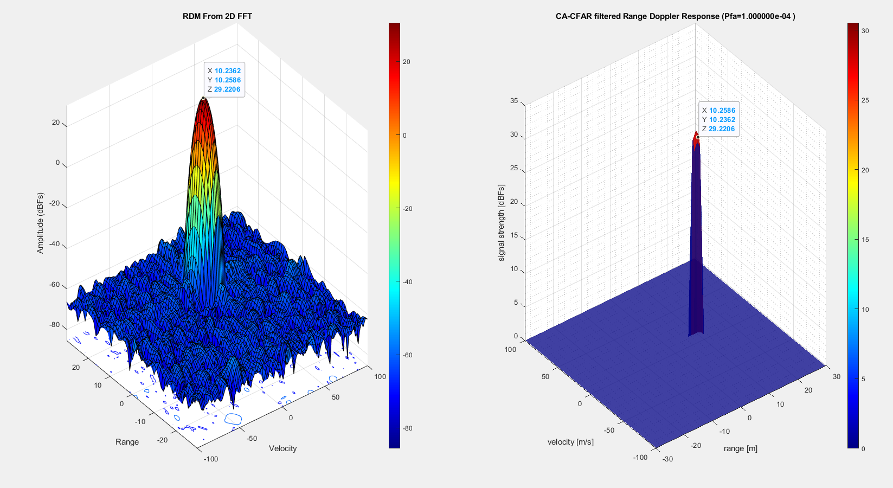

# FMCW Radar Target Generation and Detection
#### UCSD WES MAS Capstone
This folder contains scripts that allow a user to configure an FMCW waveform based on the system requirements and simulate the radar signal propagation and moving target scenario. Finally, post processing the radar signal using 1st FFT, 2nd FFT, and CA-CFAR to estimate the target's range and velocity.

## How to run the FMCW Radar simulator
1. Define the radar parameters
    ```matlab
	%% IWR68843AOP Medium Range Radar(MRR) Specifications 
	%%%%%%%%%%%%%%%%%%%%%%%%%%%
	% Frequency of operation = 60GHz
	% Max Range = 20m
	% Range Resolution = 1 m
	% Max Velocity = 10 m/s
	%%%%%%%%%%%%%%%%%%%%%%%%%%%
	% Define simulation constants
	lightspeed = physconst('LightSpeed');
	%% Define Radar parameters
	radar = Radar();
	radar.Freq_Center_hz = 60e9;
	radar.Bandwidth_hz   = 135e6;
	radar.Pulse_Width_s  = 7e-6;
	radar.Lambda_m       = freq2wavelen(radar.Freq_Center_hz,lightspeed); % Wavelength (m)
	radar.Prf_hz         = 1/radar.Pulse_Width_s;
	radar.N_pulses       = 128;
	radar.Fs_hz          = 17e6;

	% CA-CFAR parameters
	training_cells_range   = 4;
	training_cells_doppler = 4;
	gaurd_cells_range      = 2;
	gaurd_cells_doppler    = 2;
	pfa = 1e-4; % probability of false alarm

	%% Define Range and Velocity of target
	% Define the target's initial position and velocity. Note : Velocity
	% remains contant in this sim
	target = Target();
	target.Plat_Pos_m   = 10;
	target.Plat_Vel_m_s = 9.58; % Usain Bolts World record in Velocity falls within the range of our radar
	target_doppler_freq_hz = (2*target.Plat_Vel_m_s)/radar.Lambda_m;
	fprintf(1,'Target Name \n\tUsain Bolt \n');
	fprintf(1,'Target Range  \n\t%2.2f m \n',target.Plat_Pos_m);
	fprintf(1,'Target Velocity  \n\t%2.2f m\n',target.Plat_Vel_m_s);
	fprintf(1,'Target Doppler Frequency \n\t%2.2f Hz\n\n',target_doppler_freq_hz);

    ```
2. Open the [iwr6843aop_radar_sim](iwr6843aop_radar_sim.m)
3. Click Run<br/>
        

___
### Project Flow Chart


---

### 1. Simulation steps
	1. Create target data
	2. Create noise data
	3. Create datacube by combining target data + noise data
	4. Create RDM map by applying match filter to data

### 4. Signal generation and Moving Target simulation


### 5. Range Measurement
Applying the Fast Fourier Transform on the sampled beat signal to convert the signal from time domain to frequency domain and hence know the range between the target and the radar.
<p align="center">
  
</p>

### 1. Radar Specifications 
* Frequency of operation = 60GHz
* Max Range = 22.5 m
* Range Resolution = 1 m
* Max Velocity = 10 m/s
* Light Speed = 3e8 m/s

### 2. FMCW Waveform Generation
The FMCW waveform design:
* Carrier Frequency = 60 GHz
* Sampling Rate = 17 MHz
* The Bandwidth (B) = `speed_of_light / (2 * Range_Resolution_of_Radar) = 135 MHz`
* Chirp Time (Tchirp) =  `(sweep_time_factor(should be at least 5 to 6) * 2 * Max_Range_of_Radar) / speed_of_light = 7 μs`
* Slope of the FMCW chirp(Mhz/us) = `B / Tchirp = 30(MHz/us)`
* The number of chirps in one sequence (Nd) = 128
* The number of samples on each chirp (Nr)  = 119 

### 3. User Defined Range and Velocity of the simulated target

* Target Initial Range = 10 m
* Target Velocity = 10 m/s
* Simulation Result




### 6. Range Doppler Response
Applying the 2D FFT on the beat signal where the output of the first FFT gives the beat frequency, amplitude, and phase for each target. This phase varies as we move from one chirp to another due to the target’s small displacements. Once the second FFT is implemented it determines the rate of change of phase, which is nothing but the doppler frequency shift (Velocity of the targets). The output of Range Doppler response represents an image with Range on one axis and Doppler on the other. This image is called as Range Doppler Map (RDM).

* Simulation Result


### 7. CA-CFAR implementation
Applying the 2d CA-CFAR on the RDM outputed from 2D FFT to filter out the noise. As, CFAR varies the detection threshold based on the vehicle surroundings.

#### CA-CFAR algorithm:
1. Determine the number of Training cells for each dimension. Similarly, pick the number of guard cells.
2. Slide the cell under test across the complete matrix. Make sure the Cell Under Test (**CUT**) has margin for Training and Guard cells from the edges.
3. For every iteration sum the signal level within all the training cells after converting the value of the cells from logarithmic to linear using db2pow function.
4. Average the summed values for all of the training cells used. After averaging convert it back to logarithmic using pow2db.
5. Further add the offset to it to determine the threshold.
6. Next, compare the signal under CUT against this threshold.
7. If the CUT level > threshold assign the filtered signal a value of 1.

**Note:** The process above will generate a thresholded block, which is smaller than the range doppler map as the CUTs cannot be located at the edges of the matrix due to the presence of Target and Guard cells. Hence, those cells will not be thresholded. To keep the map size same as it was before CA-CFAR, the filtered signal variable is instantiated as a matrix with size equals to the range doppler map size and with all its elements equal to 0: ```zeros(Nr/2,Nd)``` .

#### Sliding Window Design:
<p align="center">
  
</p>

* Training Cells Columns = 4 cells
* Training Cells Rows = 4 cells
* Guard Cells Columns = 2 cells
* Guard Cells Rows = 3 cells
* CA-CFAR constant = `num_training_cells * ( pfa^(-1/num_training_cells) - 1);`

<br>

* Simulation Result


